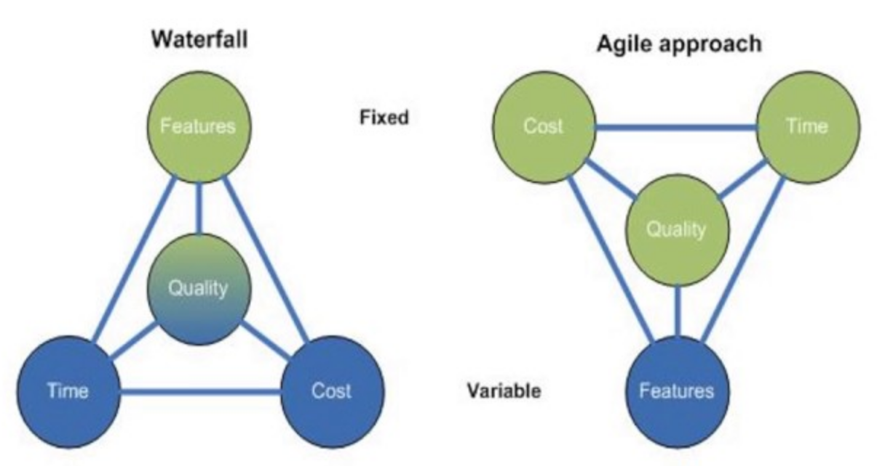
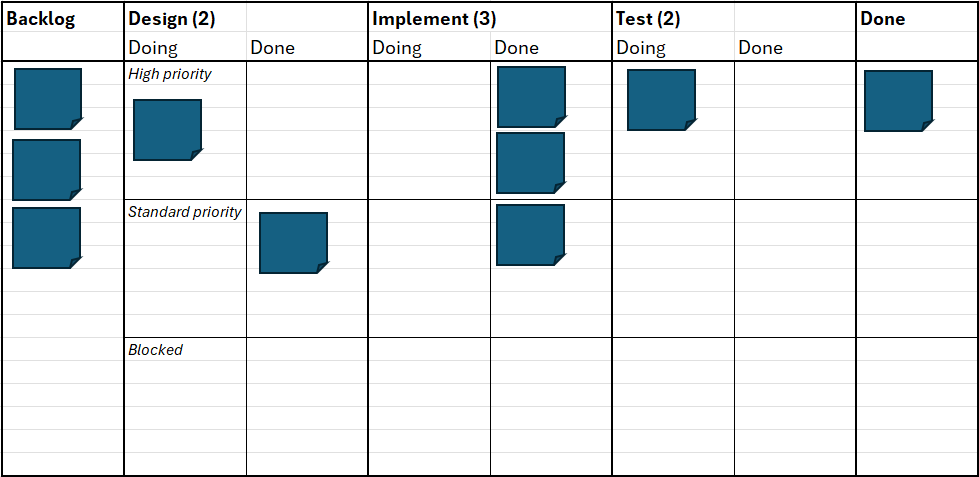

---

marp: true

theme: softwire
headingDivider: 3
paginate: true
---

# A very brief intro to Agile
*We all work on "agile" projects and probably all have "agile development" on our CVs, but what does it actually mean?*

## The iron triangle

Outlines the idea that **time**, **cost** and **scope** must be traded off in a project

- Fully-featured, on-time => **expensive**

- Low-cost, on-time => **few features**

- Fully-featured, low-cost => **late**

- Another consideration is **quality** (the "titanium tetrahedron")

## Waterfall

The original software development methodology consisting of a rigid set of phases:
- Gather requirements
- Analysis
- Design
- Coding
- Testing
- Support

## Waterfall

In waterfall, we fix scope

- Guaranteed to produce a product

- Often late and expensive (crunch!)

- Fixed set of phases is risky — detecting problems late means a major redesign!

- No support for changes (e.g. of requirements)

## The Agile Manifesto

Agile originated from the "Agile Manifesto", a set of principles to guide software development

- Individuals and interactions over processes and tools

- Working software over comprehensive documentation

- Customer collaboration over contract negotiation

- Responding to change over following a plan

## Agile

- In agile, we fix cost and time and accept that scope is variable

- We solve the problem iteratively, starting with a minimum viable product (MVP) and adding features to it
    - Agile is value-driven — we deliver requirements in order of priority
    - We may not deliver all features

- Risk declines with progress

## Agile vs Waterfall

The iron triangle returns...

## Agile principles and their difficulties

- Variable scope
*It can be hard to get the customer on-board with this if they're not used to agile!*

- Welcoming changing requirements
*Changing requirements should mean we're delivering a better product, but can lead to friction between devs and customer if it happens too often*

- Requires support and trust
*We need to trust that everyone is doing their best and uphold a blameless culture — this requires everyone to be on-board (client and consultancy)*

## Agile methodologies

Agile is just a set of principles. There are various methodologies that describe the processes to put it into action:

- Scrum

- Kanban

- Scrumban

- TDD — Test-driven development

- XP — Extreme programming

- DAD — Disciplined Agile Development

- ... and more

## Scrum

The most common methodology and probably what you use on project. 

Here are some key points:

#### User stories
- Capture scope / requirements
- Describe who, what and why (but not how)
- "As a [type of user], I want [some goal] so that [some reason]"
- Usually come from the client / end-user
- User stories are grouped into epics

## Scrum

#### Product backlog
- The backlog is developed from user stories by the product owner
- They add priority, estimated size and definitions of done to the stories

#### Sprints
- Sprints are project iterations lasting 1-4 weeks (usually 2)
- At the end of a sprint, we usually aim to produce a potentially shipable product increment
- Sprints work from a sprint backlog — a selection of user stories and tasks selected from the backlog for the current sprint
- Sprints contain various ceremonies (meetings)...

## Scrum

#### Sprint planning
- The team pulls stories / tasks from the product backlog into the sprint backlog
- Must decide which are the most important 
- Must decide how much work they think can be done in the sprint
*(This can be informed by "burndown charts" from previous sprints)*

#### Stand-up
- A daily meeting facilitated by the "scrum master"
- Discuss progress, problems and solutions
- There are many ways to run a stand-up (what have you found to be most effective?)

## Scrum

#### Backlog refinement
- Can happen at any point in the sprint
- Capture new ideas and user stories
- Identify work that needs to be broken down further
- Reassess priorities

#### Sprint review (show and tell)
- Demo the product to the customer
- Aim to receive feedback to inform future work

#### Retro
- Reflect on processes
- What worked well, what didn't etc.

## Scrum roles

There are two roles of note:

#### Product owner
- Represents the stakeholders' views (what sort of stakeholders might there be?)
- Communicates the vision for the project to the team via user stories
- Priorities stories, accepts / rejects if they've been completed

#### Scrum master
- Not a manager, should be thought of as a "servant leader" — they help remove impediments
- Point of contact for the team
- Works across teams to improve communciation
- Hosts sprint ceremonies

## Kanban

Another common approach, works particularly well for support projects

Core principles:
- Visualise workflow with a Kanban board
- Limit work-in-progress
- Make processes explicit
- Pull, don't push, work
- Improve collaboratively

## Kanban board

The board is the core of Kanban

- Columns for backlog, design, implement, done (and any others e.g. test, demo etc.)

- Each column has a maximum number of tickets that can be in it 
    - The priority in Kanban is the **completion** of highest priority work
    - If you're blocked due to column limits then you're forced to help the team resolve the bottleneck
    - The team should improve the process to reduce the likelihood of future bottlenecks

- Tickets are pulled from the left-most columns to the right-most

## Kanban board improvements

- Can add "doing" and "done" sub-columns for the various in-progress columns (design, implement, test)
    - Makes process explicit — it's obvious when a ticket is ready to be pulled into the next column by its position on the board
    - Might be solved via assignees on Jira, but is less explicit

- Can add "swimlanes" for different priorities
    - Might be solved with ticket priorities on Jira

## An example board

Which column is blocked in the board below?

## Scrumban

Some combination of the two!

- Scrum focuses on small time-boxed iterations
- Kanban focuses on continuous delivery

You probably use a form of Kanban board on your project to visualise ticket statuses!